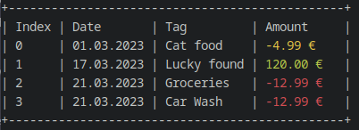

# Okane - a small tool to organize all your financials in your cli

# Dependencies

- [rang](https://github.com/agauniyal/rang) for colored console output

# Build

Currently only Windows(vs build tools) and GNU/Linux (GNU Make) are supported.

I'm using [premake5](https://premake.github.io/) to generate my project/make files.

**For GNU Make:**

```
premake5 gmake2

make config=release
```

**For other project files vistit: [Using Premake](https://premake.github.io/docs/Using-Premake)**.

# Install

**Windows (winget):**

- `winget install okane`

**Arch Linux:**

- Soon

**Flatpak:**

- planned

**Homebrew:**

- planned

# Features

- Add any income or expense with a corresponding tag
- Add repeating payments
- Display a small or detailed view of your financial status

Status view:


Detailed view:


Abo view:


Type `okane help` for more informations.

**Planned**

- Support more langauges
- Password protection
- Apple support
